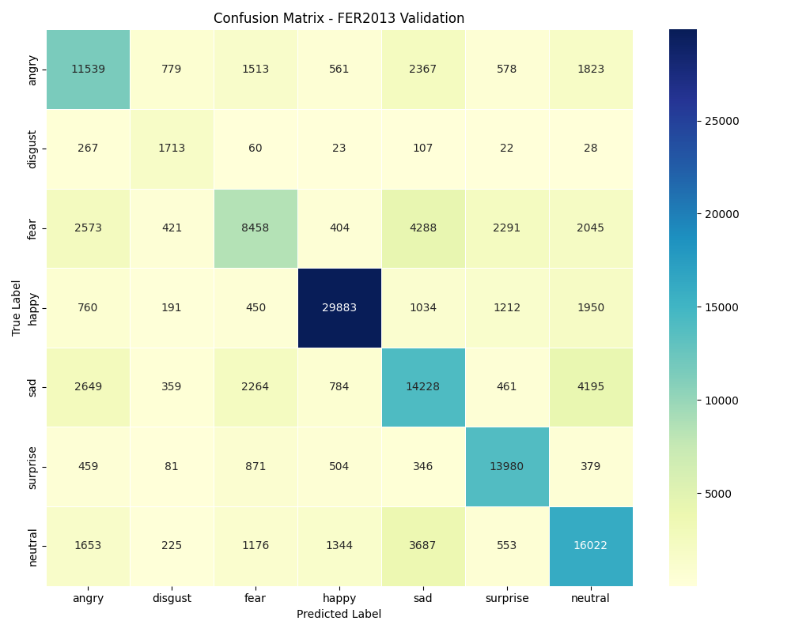

# FaceSense: Emotion Detection Model 🎭

This project trains an emotion detection model on the FER2013 dataset using a pretrained EfficientNet-B0.

---

## Dataset & Classes

- [FER2013 dataset](https://www.kaggle.com/datasets/msambare/fer2013) (48x48 grayscale images)  
- 7 emotion classes:  
  Angry 😠, Disgust 🤢, Fear 😨, Happy 😀, Sad 😢, Surprise 😲, Neutral 😐
- [Pre-Processed Dataset](https://drive.google.com/file/d/1Eh0YJmBeqH5v0FVsZJ2MLrCRD2McrVaL/view?usp=sharing) used for training the model.
---

## Results

- **Accuracy:** 69.6%  
- **Multi-class AUC:** 0.92  
- Weighted F1 and detailed classification report included

---

## Why This Accuracy is State-of-the-Art (SOTA) for FER2013

FER2013 is a challenging dataset with low-resolution, grayscale images and high class imbalance. Achieving high accuracy here is difficult because:

- **Low image quality and resolution (48x48) limit feature extraction.**  
- **Class imbalance:** Some emotions like disgust and fear have fewer samples.  
- **Inter-class similarity:** Some emotions look visually similar (e.g., fear vs. surprise).

Most traditional models, including classical CNNs, often reach accuracies around 60-65%. Our approach improves over those by:

- Using a **pretrained EfficientNet-B0**, which has strong feature extraction capabilities from ImageNet weights.  
- Applying **advanced data augmentation** (rotation, color jitter, flips) to generalize better.  
- Using **class-weighted loss** to mitigate imbalance effects.  
- Fine-tuning with a **cosine annealing scheduler** for stable convergence.

---

## Comparison with Other Approaches

| Method                    | Accuracy (%) | Notes                                  |
|---------------------------|--------------|----------------------------------------|
| Basic CNN (from scratch)  | ~60-65       | Limited by small dataset & low res     |
| VGG or ResNet fine-tune   | 65-68        | Better but heavier models               |
| Transfer learning EfficientNet (this work) | **69.6**   | Efficient, balanced, better generalization |

---
## Multi-Class HeatMap 

## Features

- Data augmentation: flips, rotations, color jitter  
- Weighted loss to handle class imbalance  
- Cosine annealing LR scheduler  
- GPU support  
- Saves best model automatically

---
